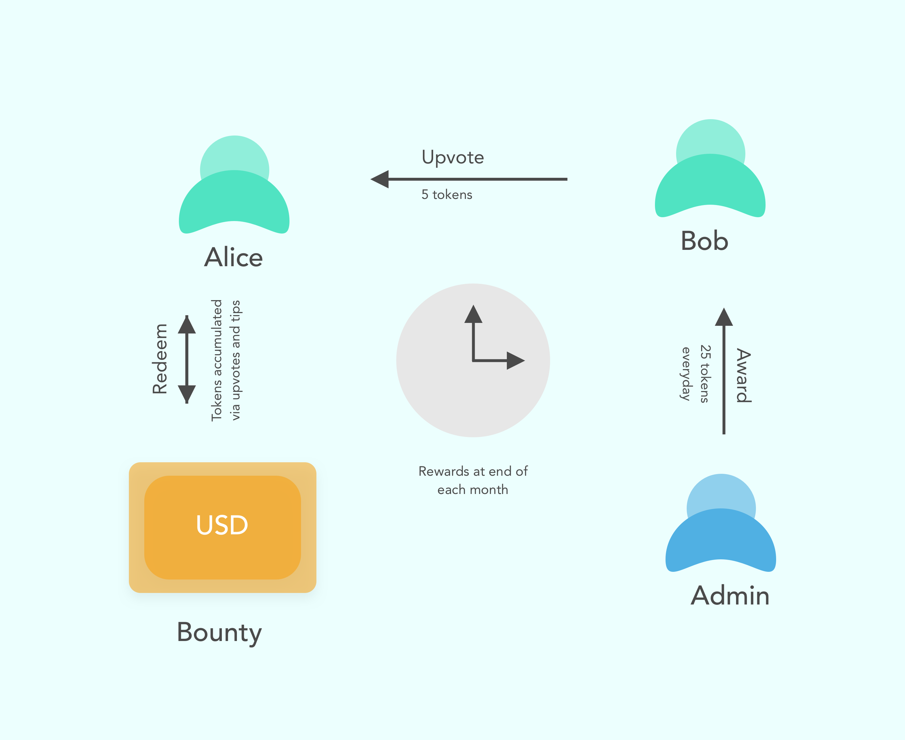
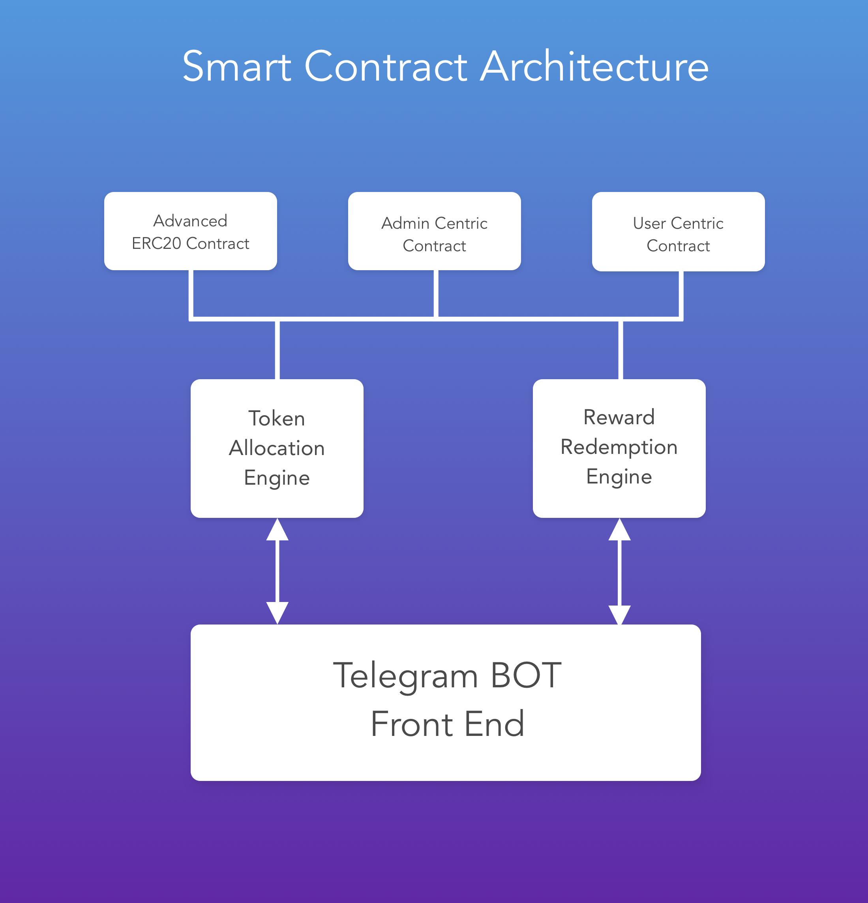

qEngage Bot Framework
=====================

qEngage is a Growth Bot Framework for Driving Engagement in Groups. We are planning to build bots across platforms such as telegram, line, whatsapp, reddit, slack and kakaotalk. We'll be releasing a telegram bot as a part of our alpha.

## Concept
The qEngage concept in detail is explained in [this](https://medium.com/qengage/qengage-core-features-and-concept-map-ce063ef1185f) medium post. Here is a short explanation

#### Summary
We’re essentially a community bot framework. Our pitch is that we enable and help brands make communities more engaging by allowing them to incentivise quality content creation and interaction. The way our framework works is best illustrated with the study of let’s say- a telegram group with 100 members. Let’s say these are members who post poems on the group.

> The qEngage Concept

#### Core Functions
Once our bot is added to the group, it will serve the following functions.
1. Allow for tipping other users and content
2. Allow for redemption of tokens by users at a specified date
3. Allow admin of group to distribute tokens to users everyday
4. Allow admin to set an exchange value between tokens and real value, called the bounty. (can be USD)

The BOT also does two things. It deducts any unspent tokens from user’s accounts at the end of the day (from those that were awarded). And it allows for accumulation of tokens gained from the user’s content being up voted or the user being tipped.

## Interface
qEngage Bot Framework supports following commands:

#### Commands that work in groups

*For User*
* `/tip @user <amount>`  - tip a user with specified token amount
* `/upvote <amount>` - reply to any message in your chat. Tips the creator with specified amount.

*For Admin*
* `/restrict @user` - restrict a user from receiving tokens hence forth
* `/unrestrict @user` - unrestrict a user from receiving tokens

#### Commands that work in DMs

*For User*
* `/balance` - this will show your current balance
* `/redeem <amount>` - to redeem tokens in exchange of bounty after specified date

*For Admin*
* `/info accounts` - summary of all accounts of supergroup
* `/info system` - information about supergroup setup
* `/info <username>` - information about a particular user, by username
* `/set_cycle <days>` - sets redemption cycle in number of days
* `/set_bounty <amount>` - set bounty for the specified period
* `/set_daily_award <amount>` - sets daily award to be given to users
* `/award @user <amount>` - awards specified user additional tokens
* `/deduct @user <amount>` - deduct tokens from specified user

## Smart Contract Architecture
The Smart Contract Architecture is explained in detail in the medium post [here](https://medium.com/qengage/qengage-technology-smart-contract-architecture-9aec73b01bc0)

#### Summary

In summary, here is an architecture diagram explaining the core components. We primarily split our architecture into *Three Heirarchial Layers*. The top most is the ***BOT Code*** (telegram, for example. But is *platform agnostic*) Then comes the ***Redemption and Allocation Engines*** that are smart contract modules built on the blockchain. Finally we boil down to the ***Core Smart Contracts*** that we will use in the final layer.

>qEngage Smart Contract Architecture

## Setup Instruction (Needs Modification)

#### Environment Variables
Setup the following environment variables in the app-env file in the root directory

`TELEGRAM_TOKEN` - token for the telegram bot for your group. Details on obtaining can be found [here](https://core.telegram.org/bots#6-botfather)

#### Steps
- Obtain Token from Bot Father
- Name and Describe your BOT, set ICON etc. using BOT Father
- Add the BOT to your **telegram group**
- Setup Privacy Mode to disabled for BOT using BOT Father
  - This is to help it access the group messages

## Pending Tasks
- [ ] Setup Instruction Modification

## Planned features (Future)
- [ ] Token Smart Contract Evolution
- [ ] User Smart Contract Evolution
- [ ] Growth Engine Spec Definition
- [ ] Growth Engine Implementation
- [ ] Roll Out alpha for Business Users

## Pricing and Support + Early Access
 For pricing and support email tejnikumbh.competitions@gmail.com

 ## Author
 - Tejas Nikumbh
   - Email: tejnikumbh.competitions@gmail.com
   - Skype: tjnikumbh

## Author
  - Tejas Nikumbh
    - Email: tejnikumbh.competitions@gmail.com
    - Skype: tjnikumbh
